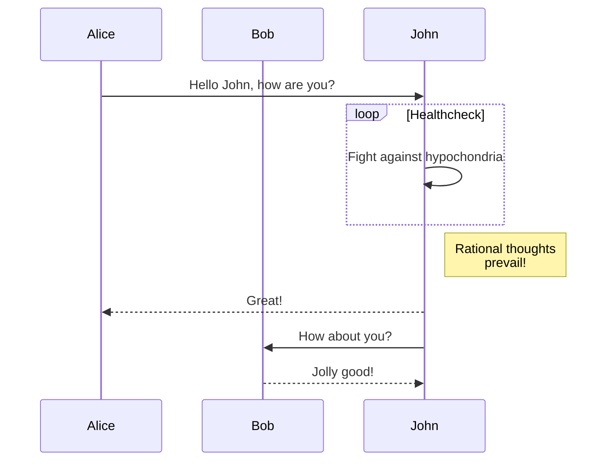

TODO

- [aquasecurity/trivy: Scanner for vulnerabilities in container images, file systems, and Git repositories, as well as for configuration issues](https://github.com/aquasecurity/trivy)
- [Rancher Desktop](https://rancherdesktop.io/)
- [codenotary/immudb: immudb - immutable database based on zero trust, SQL and Key-Value, tamperproof, data change history](https://github.com/codenotary/immudb)
- [thalo_kafka - Rust](https://docs.rs/thalo-kafka/latest/thalo_kafka/)

