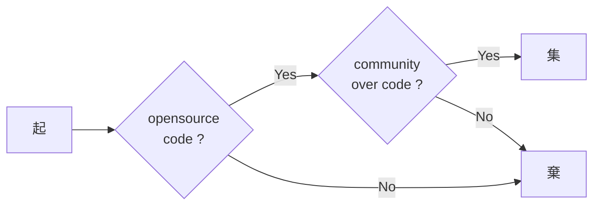

[Community over code. - The Apache Way](http://theapacheway.com/community-over-code/)

>> The biggest mantra at Apache is: “Community over code”. In brief, this means that the most successful long-lived projects value a broad and collaborative community over the details of the code itself. Apache is best at helping communities of individuals work better together - the code is a secondary, if critical, part of how we work.

