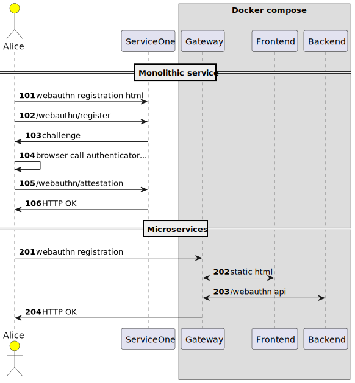

# Passkeys, WebAuthn and FIDO2

Passkeys (Passkey Authentication) https://fidoalliance.org/passkeys/

WebAuthn https://developer.mozilla.org/en-US/docs/Web/API/Web_Authentication_API#registration

- FIDO2 為一組金鑰單一裝置設備登入鑑別，Passkeys 則支援一組金鑰可登入鑑別多裝置設備。換句話說在不同設備之間同步的多設備 FIDO 鑑別憑證。
- 網站要支援 Passkeys 需要前後端一起改，前後端做法類似將 WebAuthn 整合進網站，WebAuthn 後端須支援兩階段驗證 passkeys 以及存放使用者公鑰紀錄。
- 目前 firefox 還未支援 Support WebAuthn Passkeys - Mozilla Connect https://connect.mozilla.org/t5/ideas/support-webauthn-passkeys/idi-p/14069
- herrjemand/awesome-webauthn: A curated list of awesome WebAuthn/FIDO2 and now Passkey resources https://github.com/herrjemand/awesome-webauthn
- webauthn-open-source/fido2-lib: A node.js library for performing FIDO 2.0 / WebAuthn server functionality https://github.com/webauthn-open-source/fido2-lib

# 101 🍵 webauthn registration

只進行註冊流程，後端其中涉及兩個 http endpoint

- /webauthn/register
- /webauthn/attestation

前端總計有六個步驟

- backend /webauthh/register
- 1. Server Sends Challenge, User Info, and Relying Party Info
- 2. Browser Calls authenticatorMakeCredential() on Authenticator
- 3. Authenticator Creates New Key Pair and Attestation
- 4. Authenticator Returns Data to Browser 
- 5. Browser Creates Final Data, Application sends response to Server
- 6. Server Validates and Finalizes Registration
- backend /webauthn/attestation

開發注意：

- 比較麻煩是 base64url 編碼在前端與後端的互換。
- 後端 ORIGIN 務必與瀏覽器發起註冊時一致，這點在本地開發與容器內行為有差異，例如經過 docker compose 轉換對外就需要修改成對外的 Origin - HTTP | MDN https://developer.mozilla.org/en-US/docs/Web/HTTP/Headers/Origin
- docker compose 開發時用當地預先 build 會比較快不用每次下載。

```sh
# deno run -A d101-register.ts
docker compose -f docker-compose.101.yaml up
```

比較麻煩是 base64url 編碼在前端與後端的互換。deno 可以前後端共用同一套 base64url 庫不須經過打包。只是瀏覽器需要用 module 載入並加上全域變數。

```js
<script type="module">
import { base64 } from "https://deno.land/x/b64@1.1.25/src/base64.js";
globalThis.base64 = base64;
</script>
```

- https://developer.mozilla.org/en-US/docs/Web/API/Web_Authentication_API#registration
- fido-alliance/webauthn-demo: WebAuthn Workshop Demo https://github.com/fido-alliance/webauthn-demo
- Feature request: Support for Deno/ESM · Issue #79 · webauthn-open-source/fido2-lib https://github.com/webauthn-open-source/fido2-lib/issues/79
- Pinta365/fresh_webauthn https://github.com/Pinta365/fresh_webauthn
- Hexagon/webauthn-skeleton at server/deno https://github.com/Hexagon/webauthn-skeleton/tree/server/deno
- shosatojp/webauthn-minimal: WebAuthn Minimal Server/Client https://github.com/shosatojp/webauthn-minimal
- worker-tools/webauthn-example: Example project for password-less login through WebAuthn in Cloudflare Workers and Deno. https://github.com/worker-tools/webauthn-example
- fresh_webauthn/register.ts at main · Pinta365/fresh_webauthn https://github.com/Pinta365/fresh_webauthn/blob/main/routes/webauthn/register.ts
- Antony | Blog - WebAuthn with React and Node https://antony.cloud/posts/en/webauthn/
- fido2_server/index.js at https://github.com/poruruba/fido2_server/blob/52b209799cedcff154516928f68ee677943e2ee8/fido2_server/api/controllers/fido_server/index.js
- WebAuthnを使ったFIDOサーバを立ててみた - Qiita https://qiita.com/poruruba/items/243d39c8b77b98a99bab


# 102 🚲 compose two microservices

前後端分離。



- 新增 traefik 將前端與後端分開但是整合到同一個 origin http://localhost:8700
- 因為網址對應一致不須設定 stripprefix 來去除與上游網址差。
  - 前端 /
  - 後端 /webauthn
- 前後端分離代表須一種控制兩個程式的機制，使用 bash 或是 docker compose 或是 kubectl apply 就看環境。
- 分離出各種微服有助於動態切換版本，各種的版本可以互搭。
- 有些程式附帶 watch 功能方便開發，不支援 watch 特定檔案異動的可用 watchexec 類工具加速開發。

```sh
# watchexec -w . -r 'docker compose -f docker-compose.102.yaml up'
docker compose -f docker-compose.102.yaml up
```


# 103 🐿️ oak version for deno deploy

- 一檔到底方便 deno deploy 安裝。
- deno deploy 目前還不支援 npm 安裝的 express，故改換成 oak 框架，程式差異不多，主要處理 http request 部份需注意，另外 oak 為衍生自 koa 框架。
- oakserver/oak: A middleware framework for handling HTTP with Deno 🐿️ 🦕 https://github.com/oakserver/oak
- 佈署到 deno deploy 需要設定 origin 與 docker compose 類似，該服務提供已具有憑證的網址 https 供對外公開使用。
- deno deploy 安裝範例（不確定何時消失） https://dltdojo-cd22-web090-d103.deno.dev/

```sh
# deno run -A --watch d103-register.ts
# watchexec -w . -r 'docker compose -f docker-compose.103.yaml up'
docker compose -f docker-compose.103.yaml up
```

# 104 🦕 authenticaion and login

- https://developer.mozilla.org/en-US/docs/Web/API/Web_Authentication_API#authentication
- 登入與鑑別越來越複雜，必須將 challenge 等紀錄置入 session 之中。
- 新增資料型別 IUser, IAuthenticator, IToken。
- Demo site https://dltdojo-cd22-web090-d104.deno.dev


```sh
# deno run -A --watch d104-authn.ts
docker compose -f docker-compose.104.yaml up
```

config for deno deploy

```js
const ORIGIN = Deno.env.get("ORIGIN") || "https://dltdojo-cd22-web090-d104.deno.dev";
const RPID = Deno.env.get("RPID") || "dltdojo-cd22-web090-d104.deno.dev";
const RPNAME = 'dltdojo-cd22-web090-d104.deno.dev';
```