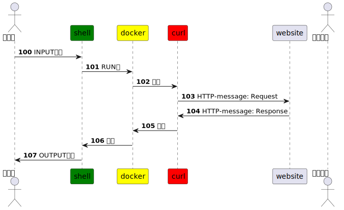

# GOAL

使用簡易工具取得最早網站的 HTTP 協定資訊。





# TOOL

- [curl](https://github.com/curl/curl)
- [Hypertext Transfer Protocol - Wikipedia](https://en.wikipedia.org/wiki/Hypertext_Transfer_Protocol)
- [Hypertext Transfer Protocol -- HTTP/1.0 rfc1945](https://datatracker.ietf.org/doc/html/rfc1945)

# INPUT

- http://info.cern.ch

# RUN

```sh
docker run --rm curlimages/curl -sv http://info.cern.ch 
```

# OUTPUT

```sh
*   Trying 188.184.21.108:80...
* Connected to info.cern.ch (188.184.21.108) port 80 (#0)
> GET / HTTP/1.1
> Host: info.cern.ch
> User-Agent: curl/7.85.0-DEV
> Accept: */*
> 
* Mark bundle as not supporting multiuse
< HTTP/1.1 200 OK
< Date: Fri, 21 Oct 2022 13:05:09 GMT
< Server: Apache
< Last-Modified: Wed, 05 Feb 2014 16:00:31 GMT
< ETag: "286-4f1aadb3105c0"
< Accept-Ranges: bytes
< Content-Length: 646
< Connection: close
< Content-Type: text/html
< 
{ [646 bytes data]
* Closing connection 0
<html><head></head><body><header>
<title>http://info.cern.ch</title>
</header>

<h1>http://info.cern.ch - home of the first website</h1>
<p>From here you can:</p>
<ul>
<li><a href="http://info.cern.ch/hypertext/WWW/TheProject.html">Browse the first website</a></li>
<li><a href="http://line-mode.cern.ch/www/hypertext/WWW/TheProject.html">Browse the first website using the line-mode browser simulator</a></li>
<li><a href="http://home.web.cern.ch/topics/birth-web">Learn about the birth of the web</a></li>
<li><a href="http://home.web.cern.ch/about">Learn about CERN, the physics laboratory where the web was born</a></li>
</ul>
</body></html>
```