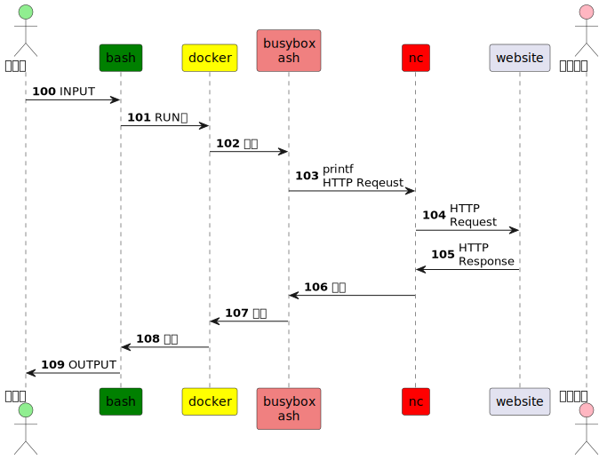

# GOAL

使用簡易工具 printf+nc 取得最早網站的 HTTP 協定資訊。





# TOOL

- [busybox Tags | Docker Hub](https://hub.docker.com/_/busybox/tags)
  - [ash(1): command interpreter - Linux man page](https://linux.die.net/man/1/ash)
- busybox+ash+printf+nc ~= curl
- [The HTTP crash course nobody asked for](https://fasterthanli.me/articles/the-http-crash-course-nobody-asked-for)
- [denoland/deno - Docker Image | Docker Hub](https://hub.docker.com/r/denoland/deno)

# INPUT

- http://info.cern.ch

# RUN

"-c Read commands from the command line. No commands will be read from the standard input."

```sh
docker run --rm busybox \
sh -c "printf 'GET / HTTP/1.1\r\nHost: info.cern.ch\r\nConnection: close\r\n\r\n' | nc info.cern.ch 80"
```


# OUTPUT

```sh
HTTP/1.1 200 OK
Date: Fri, 21 Oct 2022 15:18:03 GMT
Server: Apache
Last-Modified: Wed, 05 Feb 2014 16:00:31 GMT
ETag: "286-4f1aadb3105c0"
Accept-Ranges: bytes
Content-Length: 646
Connection: close
Content-Type: text/html

<html><head></head><body><header>
<title>http://info.cern.ch</title>
</header>

<h1>http://info.cern.ch - home of the first website</h1>
<p>From here you can:</p>
<ul>
<li><a href="http://info.cern.ch/hypertext/WWW/TheProject.html">Browse the first website</a></li>
<li><a href="http://line-mode.cern.ch/www/hypertext/WWW/TheProject.html">Browse the first website using the line-mode browser simulator</a></li>
<li><a href="http://home.web.cern.ch/topics/birth-web">Learn about the birth of the web</a></li>
<li><a href="http://home.web.cern.ch/about">Learn about CERN, the physics laboratory where the web was born</a></li>
</ul>
</body></html>
```

# ALTs

pipe 

```sh
docker run --rm busybox printf 'GET / HTTP/1.1\r\nHost: info.cern.ch\r\nConnection: close\r\n\r\n' | nc info.cern.ch 80
```

404

```sh
docker run --rm busybox \
sh -c "printf 'GET /etc/passwd HTTP/1.1\r\nHost: info.cern.ch\r\nConnection: close\r\n\r\n' | nc info.cern.ch 80"
```

deno repl

```sh
docker run -it denoland/deno repl

const resp = await fetch("http://info.cern.ch");
console.log(resp);
console.log(await resp.text());
```

deno stdin

```sh
docker run -it --entrypoint sh denoland/deno

echo 'const resp = await fetch("http://info.cern.ch"); console.log(resp); console.log(await resp.text());' | deno run --allow-net - 

cat <<EOF | deno run --allow-net - 
const resp = await fetch("http://info.cern.ch"); 
console.log(resp); 
console.log(await resp.text());
EOF
```