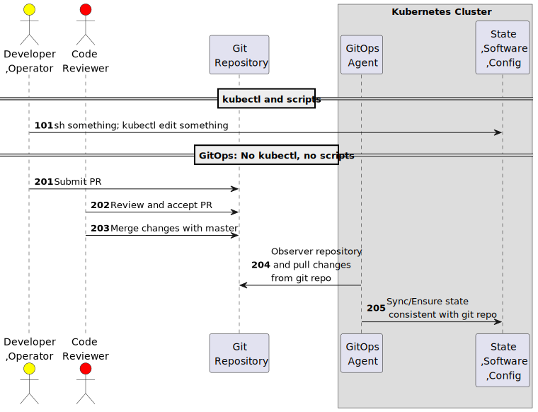

# 🏆 101 git docker 

- git - 維基百科，自由的百科全書 https://zh.wikipedia.org/zh-tw/Git
- alpine/git - Docker Image | Docker Hub https://hub.docker.com/r/alpine/git
- ECR Public Gallery - Bitnami/git https://gallery.ecr.aws/bitnami/git


```sh
docker run -i --init --rm --entrypoint=sh alpine/git:2.36.3 <<\EOF
git config --global user.email "foo1001@testing.local"
git config --global user.name "FooName1001"
mkdir /foo
cd /foo
echo hello-world-2022 > README.md
git init -q
git status
git add .
git status
ls -alh
git commit -m 'first commit'
git status
git log
git checkout -b issue302
git branch
echo $(date) >> README.md
git add README.md
git status
git clone /foo /foo123
cd /foo123
ls -alh
git branch
git status
git log
EOF
```

# 🎄 102 gitpod vscode

vscode 內建有 git 支援，目前版本測試時 chrome 環境會比 firefox 好，當 firefox 的 terminal 出現無法複製貼上時建議更換成 chrome 類瀏覽器。

- gitpod/openvscode-server Tags | Docker Hub https://hub.docker.com/r/gitpod/openvscode-server/tags
- dockerfile https://github.com/gitpod-io/openvscode-releases/blob/27f1d59c71c735a17eccfe6f2483bd1b6ea9d485/Dockerfile#L65


```sh
docker compose -f docker-compose.102.yaml up
```

# 📪 201 git http backend

git 如果是多方共用必須提供遠端存取協定，這裡使用簡化無權限控制的 cgi 模式的 git http backend 作法來支援 Git Http Service。


- Git - git-http-backend Documentation https://git-scm.com/docs/git-http-backend
- update_status/t5561-http-backend.sh at a5bf9d16d9f3a81329f1a7801274ad716b40c3e8 · srirammca53/update_status https://github.com/srirammca53/update_status/blob/a5bf9d16d9f3a81329f1a7801274ad716b40c3e8/git-1.7.1/t/t5561-http-backend.sh
- How to open git-http-backend as a http server? - Stack Overflow https://stackoverflow.com/questions/48472362/how-to-open-git-http-backend-as-a-http-server
- git/t5560-http-backend-noserver.sh at 623ac59239324d48943d3122c6be1a9f340f8dfb · gdb/git https://github.com/gdb/git/blob/623ac59239324d48943d3122c6be1a9f340f8dfb/t/t5560-http-backend-noserver.sh
- ynohat/git-http-backend: A dead simple, insecure git-over-http server using nginx https://github.com/ynohat/git-http-backend
- container-images/apache-git-http-backend - k8s-gerrit - Git at Google https://gerrit.googlesource.com/k8s-gerrit/+/refs/heads/master/container-images/apache-git-http-backend/

```sh
docker compose -f docker-compose.201.yaml up
```


# 📢 202 git push remote

建立兩個倉後個別讀取與寫入。使用 lighttpd + git-http-backend 配置，無權限控管。

- ryan0x44/local-git-server: A minimalistic Alpine-based Docker image for running a local HTTP Git server using Lighttpd https://github.com/ryan0x44/local-git-server
- How to test a system (in isolation) which needs to `git clone` | by Ryan D | Medium https://ryan0x44.medium.com/how-to-test-a-system-in-isolation-which-needs-to-git-clone-eec3449e6f7c

```sh
docker compose -f docker-compose.202.yaml up
```


# 🚲 203 docker compose version: git service and vscode

使用瀏覽器開啟 vscode 來執行 git 任務，不須安裝 git 環境。

- http://localhost:3000/?folder=/home/workspace/foo

```sh
docker compose -f docker-compose.203.yaml up
```


# 🚲 204 k8s version: git service and vscode  

kubernetes version：配置 git service 供遠端分享，由瀏覽器開啟 vscode 來執行 git 任務無須安裝 git 可用環境。

kubernetes 環境與 docker compose 的差異在於 Dockerfile 編譯鏡像後推送到 registry 供於 kubernetes cluster 內的 container image 可用，另外還必須加上 ingress 配置才能對外使用相對繁瑣的 yaml 配置。為了先省掉 registry 設置，直接在啟動 alpine 時下載 apk add lighttpd git-daemon 安裝。kubernetes 因為雲端原生配置機器可能不只一台，故不用本地的檔案與鏡像來配置，這樣相對開發階段遠比 docker compose 複雜，要看測試輸出結果也要 kubectl logs 不斷的找，並不是很直覺的 UX。

- vscode 無權限控管 http://vscode204.localhost:8300/?folder=/home/workspace/foo
- gitsrv 無權限控管 http://gitsrv204.localhost:8300


```sh
# k3d cluster create foo2021 -p "8300:80@loadbalancer" --agents 2
kubectl apply -f k204.yaml
```

# 🐐 205 kustomize git-service-vscode

將 204 拆開並可配置不同版本，不需要複製貼上重複修改 k204.yaml，代價是檔案變多必須建立一個 k205 目錄，以及將功能拆分。

- kubectl 加上 -k 針對目錄
- 打上全區標籤 app.cd22.dltdojo/name: k205
- 更換 image
- 將部份 shell script 移出 yaml
- vscode http://vscode205.localhost:8300/?folder=/home/workspace/foo

kustomize 化的一個缺點是要觀察全貌變得複雜，這個問題在 helm 上更嚴重，這雖然減少了重複性工作與可能出錯，但是切細之後要維護修補還是需要組起來觀察。

```sh
# k3d cluster create foo2021 -p "8300:80@loadbalancer" --agents 2
kubectl apply -k k205 --dry-run=client -o yaml > k205.yaml
kubectl apply -k k205
```

參考 [kustomize/examples/helloWorld at master · kubernetes-sigs/kustomize](https://github.com/kubernetes-sigs/kustomize/tree/master/examples/helloWorld)

由於已經不是單一檔案，遠端要初始化環境需要同時下載不少檔案如下：

```sh
BASE=$DEMO_HOME/base
mkdir -p $BASE

curl -s -o "$BASE/#1.yaml" "https://raw.githubusercontent.com\
/kubernetes-sigs/kustomize/master/examples/helloWorld\
/{configMap,deployment,kustomization,service}.yaml"
```

如果只是單一檔案可以使用 kubectl apply，由於沒有內部自建鏡像與registry配置可以直接在不同機器上使用。

```sh
kubectl apply -f https://raw.githubusercontent.com/dltdojo/dltdojo-cd/main/tian/cd22/web168-git/k205.yaml
```

# 🐐 206 kustomize overlays

沿用 k205 但是換掉 configmap 需要作兩件事：

- 產生新的 configmap cm-init-sh-206
- path-cm-gitsrv 換掉舊的用新的 cm-init-sh-206 蓋過去。(其實同名 cm-init-sh 也不會衝到，因為前面會被加上 stag)
- 光 patch gitsrv 不夠，vscode 初始化需要直接使用內部網址，故會出現 Could not resolve host: gitsrv205.default.svc.cluster.local 錯誤，因這裡的內部服務被改名為 service/stag-gitsrv205，如果原始沒有配置參數可改，只能直接改 vscode-init.sh。不然就是不加上 prefix。
- 另外改良 205 使用 sleep 模式常常因為 gitsrv 未就位失敗。

注意只有改 gitsrv 所以 vscode 的配置會沿用舊的版本，所以會有 cm-init-sh 與 cm-init-sh-206 同時存在。

- vscode http://vscode205.localhost:8300/?folder=/home/workspace/foo


```sh
# k3d cluster create foo2021 -p "8300:80@loadbalancer" --agents 2
kubectl apply -k k206/base --dry-run=client -o yaml > k206-base.yaml
kubectl apply -k k206/staging --dry-run=client -o yaml > k206-staging.yaml
kubectl apply -k k206/staging
```

單一檔案

```sh
kubectl apply -f https://raw.githubusercontent.com/dltdojo/dltdojo-cd/main/tian/cd22/web168-git/k206-base.yaml
kubectl apply -f https://raw.githubusercontent.com/dltdojo/dltdojo-cd/main/tian/cd22/web168-git/k206-staging.yaml
```

# 🏈 207 gitweb and git instaweb

Difference between 'git request-pull' and 'pull request' - Stack Overflow https://stackoverflow.com/questions/49423624/difference-between-git-request-pull-and-pull-request

純 git 使用 email 來通知所有者是否拉取，這點與 GitHub/GitLab/Gitea 等的流程不同。新增瀏覽界面可以不須安裝　git 也可瀏覽不同的 branch/log 紀錄。

- git http-backend 與 git instaweb 是兩件事，前者是 git 的轉接，後者只是單純瀏覽，並無 git push/pull/fetch...等協定的功能。
- gitweb http://gitweb.localhost:8300
  - 可定位網址到特定行不過網址很長
  - http://gitweb.localhost:8300/?p=bob101;a=blob;f=README.md;h=cc8959f5ba089248b8f287e13cf9632dba17dce5;hb=a18860159fc694895ed7f74659c88521eee0c1b6#l2
- vscode http://vscode.localhost:8300/?folder=/home/workspace/foo
- cd /app/repo/foo && git instaweb 不會只有 foo 會將同一階目錄的 bar, bob101 都納進來 gitweb 界面。
- alpine apk 需要 git-gitweb 與 perl-cgi 否則會有 500 error 出現。 git instaweb fails with "500 - Internal Server Error" · Issue #4871 · microsoft/WSL
https://github.com/microsoft/WSL/issues/4871
- 使用 k3d import 只適合可匯入環境，如果是無法匯入 docker build 鏡像還是需要公開基底鏡像的話須直接在 sh 內做 apk add，後者方便沒有匯入機制的環境但是每次刪減測試都需要重來耗費時間。

```sh
# k3d cluster create foo2021 -p "8300:80@loadbalancer" --agents 2
DOCKER_BUILDKIT=1 docker build -t gitsrv:0.1.3 --target=k207-gitsrv .
k3d image import gitsrv:0.1.3 -c foo2021
kubectl apply -k k207
```

沒有真正測試 git request-pull 只提供概念。

- BOB: git clone repo ; edit; git push new-repo
- VSCODE: git remote add new-repo; git fetch new-repo; git merge new-repo/branchxx

# 🌽 301 gitops argocd

- Getting Started - Argo CD - Declarative GitOps CD for Kubernetes https://argo-cd.readthedocs.io/en/stable/getting_started/
- 使用 kustomize 異動配置 argocd-cm.yaml 調整預設使用者 https://argo-cd.readthedocs.io/en/stable/operator-manual/user-management/
- 注意新版的 kustomize 配置合併不會加上獨一無二的名稱尾部，如要更新必須手動做。 Allow disabling of suffix hashes on merged ConfigMaps generated from ConfigMapGenerators https://github.com/kubernetes-sigs/kustomize/issues/4693
- 安裝 argocd 並同步 https://github.com/argoproj/argocd-example-apps/tree/master/guestbook
- 採用宣告式不使用 UI 生成 https://github.com/argoproj/argo-cd/blob/v2.5.4/docs/operator-manual/application.yaml
- 不考慮憑證問題
- 刪除 argocd app 不代表刪除資源，要分開刪除資源須手動，或是設置 finalizer 來刪除。 https://argo-cd.readthedocs.io/en/stable/user-guide/app_deletion/
- app 須設定 automated 才會自動同步資源（沒開啟資源的會新增啟動），如無設定需用 argo cli/ui 來啟動資源同步。 https://argo-cd.readthedocs.io/en/stable/user-guide/auto_sync/
- 使用 Port Forwarding https://localhost:8080

```sh
# k3d cluster create foo2021
# kubectl create namespace argocd
kubectl apply -k k301
# get admin password
kubectl -n argocd get secret argocd-initial-admin-secret -o jsonpath="{.data.password}" | base64 -d
kubectl port-forward svc/argocd-server -n argocd 8080:443
sleep 30
kubectl apply -n argocd -f k301/app301.yaml
```

gitops 參考：

- What Is GitOps https://www.weave.works/blog/what-is-gitops-really
- What is GitOps? https://www.redhat.com/en/topics/devops/what-is-gitops
- CI/CD Workflow using GitOps - Azure Arc-enabled Kubernetes - Azure Arc | Microsoft Learn https://learn.microsoft.com/en-us/azure/azure-arc/kubernetes/conceptual-gitops-ci-cd
- Search · gitops startuml https://github.com/search?l=PlantUML&p=2&q=gitops+startuml&type=Code
- Manage Kubernetes Objects | Kubernetes https://kubernetes.io/docs/tasks/manage-kubernetes-objects/
- Declarative Management of Kubernetes Objects Using Configuration Files | Kubernetes https://kubernetes.io/docs/tasks/manage-kubernetes-objects/declarative-config/

GitOps 流程關鍵在 No kubectl, no scripts （NKNS）這句。要注意的是 NKNSless 不意謂著沒有 kubectl+script 而是要求改寫到 git 去當成唯一的資訊源。

> You should avoid using Kubectl to update the cluster and especially avoid using scripts to group kubectl commands.  Instead, with a GitOps pipeline in place a user can update their Kubernetes cluster via Git.



舉例如果需要將 k8s 系統的某一個 deployment 的 replicas 調高，這時依據 gitops 不該執行 kubectl scale deployment/nginx-deployment --replicas=10 而是提 pull request 內有 nginx-deployment yaml 新的 replicas 配置後經測試無誤在同步到 k8s 上。

換句話說也不一定是針對 k8s 系統才能做 GitOps，該流程要求系統調整時不能直接改，必須先紀錄、提交、審核、測試驗證、自動同步狀態。

為何 k8s 比較常見是因為其原生具備 Declarative Management 機制，只要 kubectl apply 即可修正狀態。


# 30x CI: argo workflow

- argo-workflows/ci.yaml at master · argoproj/argo-workflows https://github.com/argoproj/argo-workflows/blob/master/examples/ci.yaml
- argo-workflows/ci-output-artifact.yaml at master · argoproj/argo-workflows https://github.com/argoproj/argo-workflows/blob/master/examples/ci-output-artifact.yaml
- argo-workflows/buildkit-template.yaml at master · argoproj/argo-workflows https://github.com/argoproj/argo-workflows/blob/master/examples/buildkit-template.yaml


# 🍵 401 gitea

使用 git-http-backend 適合的對象是 git 這種客戶端，對於開發者需要與其他人（無安裝 git 環境）討論時需要另外的程式碼瀏覽服務與議題 issue 服務。gitea 提供額外的服務但是容器體積也變大數倍。


