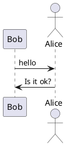
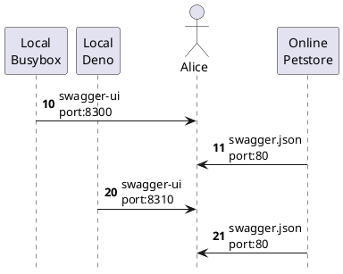
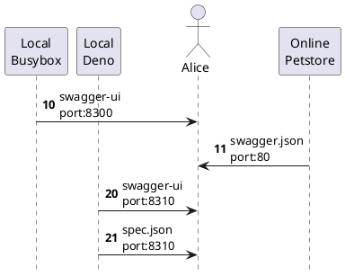

# task101

目標是 http://localhost:8300 可以看到 openapi 的使用界面。

```text
                          ,-.                      
                          `-'                      
     ,-------.            /|\            ,--------.
     |Local  |             |             |Online  |
     |Busybox|            / \            |Petstore|
     `---+---'           Alice           `---+----'
         | 10 swagger-ui   |                 |     
         |---------------->|                 |     
         |                 |                 |     
         |                 |20 swagger.json  |     
         |                 |<----------------|     
         |                 |                 |     
         |                 |                 |     
```

需要新增一個臨時目錄 ```mkdir /tmp/api101``` 供測試。

```sh
cat > /tmp/api101/Dockerfile <<\EOF
FROM busybox:1.35.0 AS BUSYBOX
ARG SWAGGER_UI_VERSION="4.15.2"
RUN cd /tmp && \
  wget "https://github.com/swagger-api/swagger-ui/archive/v$SWAGGER_UI_VERSION.zip" && \
  unzip "v$SWAGGER_UI_VERSION.zip" -d swagger-ui && \
  mkdir -p /opt/webroot/api-ui && \
  cp -r "swagger-ui/swagger-ui-$SWAGGER_UI_VERSION/dist/." /opt/webroot/api-ui/
EOF
cat > /tmp/api101/docker-compose.yaml <<\EOF
version: "3.8"
services:
  box101:
    build:
      context: .
      target: BUSYBOX
    command:
      - /bin/sh
      - -c
      - |
        cd /opt/webroot/api-ui/
        busybox httpd -f -v -p 3000
    ports:
      - "8300:3000"
EOF
docker compose --project-directory=/tmp/api101 up --build
docker compose --project-directory=/tmp/api101 rm
```

測試完記得 ```rm -rf /tmp/api101``` 刪掉。



# task102

目標是沿用上面的 image 不另外下載並用不同服務可看到 openapi 的使用界面。

- Local Busybox http http://localhost:8300
- Local Deno file server http://localhost:8310

```text
                                           ,-.                      
                                           `-'                      
     ,-------.          ,-----.            /|\            ,--------.
     |Local  |          |Local|             |             |Online  |
     |Busybox|          |Deno |            / \            |Petstore|
     `---+---'          `--+--'           Alice           `---+----'
         |          10 swagger-ui           |                 |     
         |          port:8300               |                 |     
         |--------------------------------->|                 |     
         |                 |                |                 |     
         |                 |                |11 swagger.json  |     
         |                 |                |port:80          |     
         |                 |                |<----------------|     
         |                 |                |                 |     
         |                 | 20 swagger-ui  |                 |     
         |                 | port:8310      |                 |     
         |                 |--------------->|                 |     
         |                 |                |                 |     
         |                 |                |21 swagger.json  |     
         |                 |                |port:80          |     
         |                 |                |<----------------|     
         |                 |                |                 |     
         |                 |                |                 |     
```

docker compose up

```sh
cat > /tmp/api101/Dockerfile <<\EOF
FROM busybox:1.35.0 AS BUSYBOX
ARG SWAGGER_UI_VERSION="4.15.2"
RUN cd /tmp && \
  wget "https://github.com/swagger-api/swagger-ui/archive/v$SWAGGER_UI_VERSION.zip" && \
  unzip "v$SWAGGER_UI_VERSION.zip" -d swagger-ui && \
  mkdir -p /opt/webroot/api-ui && \
  cp -r "swagger-ui/swagger-ui-$SWAGGER_UI_VERSION/dist/." /opt/webroot/api-ui/

FROM denoland/deno:1.27.1 AS DENO
COPY --from=BUSYBOX /opt/webroot/api-ui/ /opt/webroot/api-ui/
RUN deno install --root=/usr/local --allow-net --allow-read https://deno.land/std@0.159.0/http/file_server.ts
EOF
cat > /tmp/api101/docker-compose.yaml <<\EOF
services:
  box101:
    build:
      context: .
      target: BUSYBOX
    command:
      - /bin/sh
      - -c
      - |
        cd /opt/webroot/api-ui/
        busybox httpd -f -v -p 3000
    ports:
      - "8300:3000"
  deno101:
    build:
      context: .
      target: DENO
    command:
      - /bin/sh
      - -c
      - |
        file_server /opt/webroot/api-ui/ --port 4507
    ports:
      - "8310:4507"
EOF
docker compose --project-directory=/tmp/api101 up --build
docker compose --project-directory=/tmp/api101 rm
```

共用一個 Dockerfile 內有兩個目標。



# task103

目標是使用 zod + zod-to-openapi 動態生成 openapi 的設定檔 spec.json。

- Local Busybox http http://localhost:8300
- Local Deno file server http://localhost:8310
- https://github.com/colinhacks/zod
- https://github.com/asteasolutions/zod-to-openapi


```text
                                           ,-.                      
                                           `-'                      
     ,-------.          ,-----.            /|\            ,--------.
     |Local  |          |Local|             |             |Online  |
     |Busybox|          |Deno |            / \            |Petstore|
     `---+---'          `--+--'           Alice           `---+----'
         |          10 swagger-ui           |                 |     
         |          port:8300               |                 |     
         |--------------------------------->|                 |     
         |                 |                |                 |     
         |                 |                |11 swagger.json  |     
         |                 |                |port:80          |     
         |                 |                |<----------------|     
         |                 |                |                 |     
         |                 | 20 swagger-ui  |                 |     
         |                 | port:8310      |                 |     
         |                 |--------------->|                 |     
         |                 |                |                 |     
         |                 | 21 spec.json   |                 |     
         |                 | port:8310      |                 |     
         |                 |--------------->|                 |     
         |                 |                |                 |     
         |                 |                |                 |     
```

docker compose up

```sh
cat > /tmp/api101/api101.ts <<\EOF
import { z } from "https://deno.land/x/zod@v3.19.1/mod.ts";
import {
    OpenAPIRegistry,
    OpenAPIGenerator,
    extendZodWithOpenApi,
} from 'https://esm.sh/@asteasolutions/zod-to-openapi@2.3.0';
extendZodWithOpenApi(z);
const registry = new OpenAPIRegistry();
const UserSchema = registry.register(
    'User',
    z.object({
        id: z.string().openapi({ example: '12dddrrrsxx' }),
        name: z.string().openapi({ example: 'John Doe' }),
        age: z.number().openapi({ example: 42 }),
    })
);
registry.registerPath({
    method: 'get',
    path: '/users/{id}',
    description: 'Get user data by its id',
    summary: 'Get a single user',
    request: {
        params: z.object({
            id: z.string().openapi({ example: '1212121' }),
        }),
    },
    responses: {
        200: {
            description: 'Object with user data.',
            content: {
                'application/json': {
                    schema: UserSchema,
                },
            },
        },
        204: {
            description: 'No content - successful operation',
        },
    },
});
const generator = new OpenAPIGenerator(registry.definitions, '3.0.0');
const doc = generator.generateDocument({
    openapi: "3.0.0",
    info: {
      version: '1.0.0',
      title: '2022-1104 My API',
      description: 'This is the API',
    },
    servers: [{ url: 'v1' }],
  });
console.log(JSON.stringify(doc))
EOF
cat > /tmp/api101/Dockerfile <<\EOF
FROM busybox:1.35.0 AS BUSYBOX
ARG SWAGGER_UI_VERSION="4.15.2"
RUN cd /tmp && \
  wget "https://github.com/swagger-api/swagger-ui/archive/v$SWAGGER_UI_VERSION.zip" && \
  unzip "v$SWAGGER_UI_VERSION.zip" -d swagger-ui && \
  mkdir -p /opt/webroot/api-ui && \
  cp -r "swagger-ui/swagger-ui-$SWAGGER_UI_VERSION/dist/." /opt/webroot/api-ui/

FROM denoland/deno:1.27.1 AS DENO
COPY --from=BUSYBOX /opt/webroot/api-ui/ /opt/webroot/api-ui/
RUN deno install --root=/usr/local --allow-net --allow-read https://deno.land/std@0.159.0/http/file_server.ts
ADD api101.ts /tmp/api101.ts
EOF
cat > /tmp/api101/docker-compose.yaml <<\EOF
services:
  box101:
    build:
      context: .
      target: BUSYBOX
    command:
      - /bin/sh
      - -c
      - |
        cd /opt/webroot/api-ui/
        busybox httpd -f -v -p 3000
    ports:
      - "8300:3000"
  deno101:
    build:
      context: .
      target: DENO
    command:
      - /bin/sh
      - -c
      - |
        sed -i "s|https://petstore.swagger.io/v2/swagger.json|spec-deno.json|g" /opt/webroot/api-ui/swagger-initializer.js
        deno run --allow-net --allow-env /tmp/api101.ts > /opt/webroot/api-ui/spec-deno.json
        file_server /opt/webroot/api-ui/ --port 4507
    ports:
      - "8310:4507"
EOF
docker compose --project-directory=/tmp/api101 up --build
docker compose --project-directory=/tmp/api101 rm
```

使用 TypeScript 生成不另外編寫。

