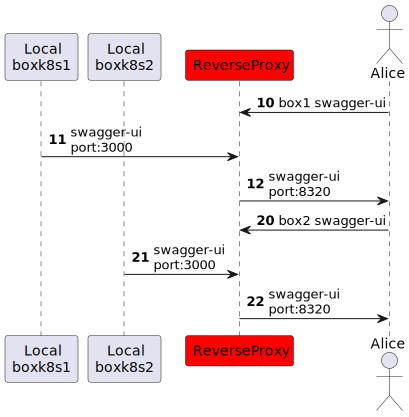

# task101

目標是瀏覽器開啟 http://localhost:8300 可以看到 openapi 的使用相關界面以及使用的範例如 ```curl```等等。。

```text
                          ,-.                      
                          `-'                      
     ,-------.            /|\            ,--------.
     |Local  |             |             |Online  |
     |Busybox|            / \            |Petstore|
     `---+---'           Alice           `---+----'
         | 10 swagger-ui   |                 |     
         |---------------->|                 |     
         |                 |                 |     
         |                 |20 swagger.json  |     
         |                 |<----------------|     
         |                 |                 |     
         |                 |                 |     
```

測試過程檔案多只用很長的```stdin```餵入 heredoc 太多複雜，下面需要新增一個臨時目錄 ```mkdir /tmp/api101``` 供測試。同時為了方便設置下列別稱 ```dbuild, dcup, endgame```等供後續使用。

```sh
mkdir /tmp/api101
alias dbuild="DOCKER_BUILDKIT=1 docker build"
alias dcup="docker compose --project-directory=/tmp/api101 rm -sf; docker compose --project-directory=/tmp/api101 up"
alias endgame="docker compose --project-directory=/tmp/api101 rm -sf; rm -rf /tmp/api101"
```

建立 docker image 並執行 docker compose up。也可以使用生成 Dockerfile 方式讓 docker compose build 來編譯出鏡像，不過為了接近 kubernetes 環境還是採用 docker 編譯鏡像 docker compose 只負責調度的模式。

```sh
dbuild -t api101-busybox - <<\EOF
# syntax=docker/dockerfile:1.3-labs
FROM busybox:1.35.0
ARG SWAGGER_UI_VERSION="4.15.2"
RUN <<\EOOF
  cd /tmp
  wget "https://github.com/swagger-api/swagger-ui/archive/v$SWAGGER_UI_VERSION.zip"
  unzip "v$SWAGGER_UI_VERSION.zip" -d swagger-ui
  mkdir -p /opt/webroot/api-ui
  cp -r "swagger-ui/swagger-ui-$SWAGGER_UI_VERSION/dist/." /opt/webroot/api-ui/
EOOF
EOF

cat > /tmp/api101/docker-compose.yaml <<\EOF
version: "3.8"
services:
  box101:
    image: api101-busybox
    command:
      - /bin/sh
      - -c
      - |
        cd /opt/webroot/api-ui/
        # sed -i "s|https://petstore.swagger.io/v2/swagger.json|spec-foo.json|g" /opt/webroot/api-ui/swagger-initializer.js
        busybox httpd -f -v -p 3000
    ports:
      - "8300:3000"
EOF
dcup
```

測試完如果後面不再運行可以 ```rm -rf /tmp/api101```或```endgame```刪掉。


# task102

目標是沿用上面的 image 不另外下載 swagger ui，並用不同服務看到 OpenAPI 的使用界面。

- Local Busybox http http://localhost:8300
- Local Deno file server http://localhost:8310

```text
                                           ,-.                      
                                           `-'                      
     ,-------.          ,-----.            /|\            ,--------.
     |Local  |          |Local|             |             |Online  |
     |Busybox|          |Deno |            / \            |Petstore|
     `---+---'          `--+--'           Alice           `---+----'
         |          10 swagger-ui           |                 |     
         |          port:8300               |                 |     
         |--------------------------------->|                 |     
         |                 |                |                 |     
         |                 |                |11 swagger.json  |     
         |                 |                |port:80          |     
         |                 |                |<----------------|     
         |                 |                |                 |     
         |                 | 20 swagger-ui  |                 |     
         |                 | port:8310      |                 |     
         |                 |--------------->|                 |     
         |                 |                |                 |     
         |                 |                |21 swagger.json  |     
         |                 |                |port:80          |     
         |                 |                |<----------------|     
         |                 |                |                 |     
         |                 |                |                 |     
```

建立鏡像後調度啟動服務如下：

```sh
dbuild -t api101-deno --target=stage2 - <<\EOF
# syntax=docker/dockerfile:1.3-labs
FROM busybox:1.35.0 AS stage1
ARG SWAGGER_UI_VERSION="4.15.2"
RUN <<\EOOF
  cd /tmp
  wget "https://github.com/swagger-api/swagger-ui/archive/v$SWAGGER_UI_VERSION.zip"
  unzip "v$SWAGGER_UI_VERSION.zip" -d swagger-ui
  mkdir -p /opt/webroot/api-ui
  cp -r "swagger-ui/swagger-ui-$SWAGGER_UI_VERSION/dist/." /opt/webroot/api-ui/
EOOF
FROM denoland/deno:1.27.1 AS stage2
COPY --from=stage1 /opt/webroot/api-ui/ /opt/webroot/api-ui/
RUN deno install --root=/usr/local --allow-net --allow-read https://deno.land/std@0.159.0/http/file_server.ts
EOF

cat > /tmp/api101/docker-compose.yaml <<\EOF
services:
  box101:
    image: api101-busybox
    command:
      - /bin/sh
      - -c
      - |
        cd /opt/webroot/api-ui/
        busybox httpd -f -v -p 3000
    ports:
      - "8300:3000"
  deno101:
    image: api101-deno
    command:
      - /bin/sh
      - -c
      - |
        file_server /opt/webroot/api-ui/ --port 4507
    ports:
      - "8310:4507"
EOF
dcup
```

編譯兩個鏡像共用一個 Dockerfile。


# task103

目標是使用 zod + zod-to-openapi 動態生成 openapi 的設定檔 spec.json。

- Local Busybox http http://localhost:8300
- Local Deno file server http://localhost:8310
- https://github.com/colinhacks/zod
- https://github.com/asteasolutions/zod-to-openapi


```text
                                           ,-.                      
                                           `-'                      
     ,-------.          ,-----.            /|\            ,--------.
     |Local  |          |Local|             |             |Online  |
     |Busybox|          |Deno |            / \            |Petstore|
     `---+---'          `--+--'           Alice           `---+----'
         |          10 swagger-ui           |                 |     
         |          port:8300               |                 |     
         |--------------------------------->|                 |     
         |                 |                |                 |     
         |                 |                |11 swagger.json  |     
         |                 |                |port:80          |     
         |                 |                |<----------------|     
         |                 |                |                 |     
         |                 | 20 swagger-ui  |                 |     
         |                 | port:8310      |                 |     
         |                 |--------------->|                 |     
         |                 |                |                 |     
         |                 | 21 spec.json   |                 |     
         |                 | port:8310      |                 |     
         |                 |--------------->|                 |     
         |                 |                |                 |     
         |                 |                |                 |     
```

生成規格：

```sh
cat > /tmp/api101/api101.ts <<\EOF
import { z } from "https://deno.land/x/zod@v3.19.1/mod.ts";
import {
    OpenAPIRegistry,
    OpenAPIGenerator,
    extendZodWithOpenApi,
} from 'https://esm.sh/@asteasolutions/zod-to-openapi@2.3.0';
extendZodWithOpenApi(z);
const registry = new OpenAPIRegistry();
const UserSchema = registry.register(
    'User',
    z.object({
        id: z.string().openapi({ example: '12dddrrrsxx' }),
        name: z.string().openapi({ example: 'John Doe' }),
        age: z.number().openapi({ example: 42 }),
    })
);
registry.registerPath({
    method: 'get',
    path: '/users/{id}',
    description: 'Get user data by its id',
    summary: 'Get a single user',
    request: {
        params: z.object({
            id: z.string().openapi({ example: '1212121' }),
        }),
    },
    responses: {
        200: {
            description: 'Object with user data.',
            content: {
                'application/json': {
                    schema: UserSchema,
                },
            },
        },
        204: {
            description: 'No content - successful operation',
        },
    },
});
const generator = new OpenAPIGenerator(registry.definitions, '3.0.0');
const doc = generator.generateDocument({
    openapi: "3.0.0",
    info: {
      version: '1.0.0',
      title: '2022-1104 My API',
      description: 'This is the API',
    },
    servers: [{ url: 'v1' }],
  });
console.log(JSON.stringify(doc))
EOF
```

編譯鏡像調度服務。

```sh
dbuild -t api101-deno --target=stage2 -f - /tmp/api101 <<\EOF
# syntax=docker/dockerfile:1.3-labs
FROM busybox:1.35.0 AS stage1
ARG SWAGGER_UI_VERSION="4.15.2"
RUN <<\EOOF
  cd /tmp
  wget "https://github.com/swagger-api/swagger-ui/archive/v$SWAGGER_UI_VERSION.zip"
  unzip "v$SWAGGER_UI_VERSION.zip" -d swagger-ui
  mkdir -p /opt/webroot/api-ui
  cp -r "swagger-ui/swagger-ui-$SWAGGER_UI_VERSION/dist/." /opt/webroot/api-ui/
EOOF
FROM denoland/deno:1.27.1 AS stage2
COPY --from=stage1 /opt/webroot/api-ui/ /opt/webroot/api-ui/
RUN deno install --root=/usr/local --allow-net --allow-read https://deno.land/std@0.159.0/http/file_server.ts
ADD api101.ts /tmp/api101.ts
EOF

cat > /tmp/api101/docker-compose.yaml <<\EOF
services:
  box101:
    image: api101-busybox
    command:
      - /bin/sh
      - -c
      - |
        cd /opt/webroot/api-ui/
        busybox httpd -f -v -p 3000
    ports:
      - "8300:3000"
  deno101:
    image: api101-deno
    command:
      - /bin/sh
      - -c
      - |
        sed -i "s|https://petstore.swagger.io/v2/swagger.json|spec-deno.json|g" /opt/webroot/api-ui/swagger-initializer.js
        deno run --allow-net --allow-env /tmp/api101.ts > /opt/webroot/api-ui/spec-deno.json
        file_server /opt/webroot/api-ui/ --port 4507
    ports:
      - "8310:4507"
EOF
dcup
```

使用 TypeScript 生成 spec-deno.json 不另外編寫，另外將設定檔位置使用```sed```更換。上述需要將檔案加入```ADD```但又使用```stdin```需要設定正確路徑否則無法正確加入，也可以使用加掛```VOLUME```方式，不過為了方便遷移與適合 kubernetes 環境，盡可能將預先需要檔案放在編譯鏡像 image 內，啟動後在用 shell script 微調設定。


# task104

目標本地輸出 kubernetes openapi 的設定。

- Local Busybox1 http http://localhost:8300
- Local Busybox2 http http://localhost:8310


編譯鏡像後調度啟動服務

```sh
dbuild -t api101-k8sapi --target=stage2 - <<\EOF
# syntax=docker/dockerfile:1.3-labs
FROM busybox:1.35.0 AS stage1
ARG SWAGGER_UI_VERSION="4.15.2"
RUN <<\EOOF
  cd /tmp
  wget "https://github.com/swagger-api/swagger-ui/archive/v$SWAGGER_UI_VERSION.zip"
  unzip "v$SWAGGER_UI_VERSION.zip" -d swagger-ui
  mkdir -p /opt/webroot/api-ui
  cp -r "swagger-ui/swagger-ui-$SWAGGER_UI_VERSION/dist/." /opt/webroot/api-ui/
EOOF
FROM stage1 AS stage2
RUN <<\EOOF
  wget -O /opt/webroot/api-ui/swagger.json https://github.com/kubernetes/kubernetes/raw/release-1.25/api/openapi-spec/swagger.json
  sed -i "s|https://petstore.swagger.io/v2/swagger.json|swagger.json|g" /opt/webroot/api-ui/swagger-initializer.js
EOOF
EOF

cat > /tmp/api101/docker-compose.yaml <<\EOF
services:
  boxk8s1:
    image: api101-k8sapi
    command:
      - /bin/sh
      - -c
      - |
        cd /opt/webroot/api-ui/
        busybox httpd -f -v -p 3000
    ports:
      - "8300:3000"
  boxk8s2:
    image: api101-k8sapi
    command:
      - /bin/sh
      - -c
      - |
        sed -i "s|swagger.json|http://localhost:8300/swagger.json|g" /opt/webroot/api-ui/swagger-initializer.js
        cd /opt/webroot/api-ui/
        busybox httpd -f -v -p 3000
    ports:
      - "8310:3000"
EOF
dcup
```

上面 boxk8s2 會出現一個 CORS 錯誤。不過 busybox http 是簡單的服務，並不支援設定，參考[How to set header with busybox httpd - Server Fault](https://serverfault.com/questions/918602/how-to-set-header-with-busybox-httpd)。

```text
Possible cross-origin (CORS) issue? The URL origin (http://localhost:8300) does 
not match the page (http://localhost:8310). Check the server returns the correct
 'Access-Control-Allow-*' headers.
```


取得 kubernets openapi swagger json 也可於 busybox 啟動後進行，只是每次啟動都拉取一次沒效率。


# task105

目標為無法更動原服務端的 CORS 配置下，新增一個中介的反向代理服務或 API Gateway 來設定後端服務加上 CORS 配置，將原無 CORS 配置服務轉成有配置對外輸出。常見配置選用 Nginx 但這裡使用 KrakenD 測試。設定檔格式 KrakenD 比 Nginx 較明確容易編輯。

- Local Busybox1 http http://localhost:8300
- Local Busybox2 http http://localhost:8310
- Local KrakenD(API Gateway) http http://localhost:8320


配置反向代理的服務並啟用 CORS 如下：

```sh
cat > /tmp/api101/docker-compose.yaml <<\EOF
services:
  boxk8s1:
    image: api101-k8sapi
    command:
      - /bin/sh
      - -c
      - |
        cd /opt/webroot/api-ui/
        busybox httpd -f -v -p 3000
    ports:
      - "8300:3000"
  boxk8s2:
    image: api101-k8sapi
    command:
      - /bin/sh
      - -c
      - |
        sed -i "s|swagger.json|http://localhost:8320/api-spec.json|g" /opt/webroot/api-ui/swagger-initializer.js
        cd /opt/webroot/api-ui/
        busybox httpd -f -v -p 3000
    ports:
      - "8310:3000"
  krakend:
    image: devopsfaith/krakend:2.1.2
    entrypoint: /bin/sh
    command:
      - -c
      - |
        cat > /tmp/krakend.yaml <<\EOOF
        version: 3
        endpoints:
        - endpoint: "/api-spec.json"
          output_encoding: json
          method: GET
          backend:
          - host:
            - http://boxk8s1:3000
            method: GET
            url_pattern: "/swagger.json"
        extra_config:
          security/cors:
            allow_origins:
            - "*"
            allow_methods:
            - GET
            - HEAD
            - POST
            expose_headers:
            - Content-Length
            - Content-Type
            allow_headers:
            - Accept-Language
            max_age: 12h
            allow_credentials: false
            debug: false
        EOOF
        /usr/bin/krakend run -c /tmp/krakend.yaml
    ports:
      - "8320:8080"
EOF
dcup
```

設定檔 krakend yaml 也可以用其他如 json 格式。

```yaml
version: 3
endpoints:
- endpoint: "/api-spec.json"
  output_encoding: json
  method: GET
  backend:
  - host:
    - http://boxk8s1:3000
    method: GET
    url_pattern: "/swagger.json"
extra_config:
  security/cors:
    allow_origins:
    - "*"
    allow_methods:
    - GET
    - HEAD
    - POST
    expose_headers:
    - Content-Length
    - Content-Type
    allow_headers:
    - Accept-Language
    max_age: 12h
    allow_credentials: false
    debug: false
```

對接到內部上游 boxk8s1 服務。與上個任務類似但藉由中介反向代理增加設定來提供可用 CORS 設定。


# task106

單一檔案路徑的上游反向代理轉接加上 CORS 設定對於 KrankenD 這種 API Gateway 為主的專案實現容易，換成不特定路徑檔案資源而目標為只有單一 port 8300 對外服務的 Virtual Host 時候，KrakenD 專案需要使用商業版本功能。

- Busybox1
  - http://localhost:8320/box1/index.html
  - http://box1.localhost:8320/index.html
- Busybox2
  - http://localhost:8320/box2/index.html
  - http://box2.localhost:8320/index.html



```sh
cat > /tmp/api101/docker-compose.yaml <<\EOF
services:
  boxk8s1:
    image: api101-k8sapi
    command:
      - /bin/sh
      - -c
      - |
        cd /opt/webroot/api-ui/
        busybox httpd -f -v -p 3000
    ports:
      - "8300:3000"
  boxk8s2:
    image: api101-k8sapi
    command:
      - /bin/sh
      - -c
      - |
        cd /opt/webroot/api-ui/
        busybox httpd -f -v -p 3000
    ports:
      - "8310:3000"
  krakend:
    image: devopsfaith/krakend:2.1.2
    entrypoint: /bin/sh
    command:
      - -c
      - |
        cat > /tmp/krakend.yaml <<\EOOF
        version: 3
        endpoints:
        - endpoint: "/box1/{path1}"
          output_encoding: no-op
          method: GET
          backend:
          - host:
            - http://boxk8s1:3000
            method: GET
            url_pattern: "/{path1}"
            encoding: no-op
        - endpoint: "/box2/{path1}"
          output_encoding: no-op
          method: GET
          backend:
          - host:
            - http://boxk8s2:3000
            method: GET
            url_pattern: "/{path1}"
            encoding: no-op
        EOOF
        /usr/bin/krakend run -c /tmp/krakend.yaml
    ports:
      - "8320:8080"
EOF
dcup
```

上面為單一樣式資源```host/box1 to upstream_box1```轉接，但是支援 virtual host 為 KrakenD 企業版功能，多數靜態檔案但未知模式的資源轉接管理 ```virtual_host_box1 to upstream_box1``` 非其主要使用方式，下為無法完成的測試的配置，因為缺乏商業版的 plugin。

```sh
cat > /tmp/api101/docker-compose.yaml <<\EOF
services:
  boxk8s1:
    image: api101-k8sapi
    command:
      - /bin/sh
      - -c
      - |
        cd /opt/webroot/api-ui/
        busybox httpd -f -v -p 3000
    ports:
      - "8300:3000"
  boxk8s2:
    image: api101-k8sapi
    command:
      - /bin/sh
      - -c
      - |
        cd /opt/webroot/api-ui/
        busybox httpd -f -v -p 3000
    ports:
      - "8310:3000"
  krakend:
    image: devopsfaith/krakend:2.1.2
    entrypoint: /bin/sh
    command:
      - -c
      - |
        cat > /tmp/krakend.yaml <<\EOOF
        version: 3
        plugin:
          pattern: ".so"
          folder: "/opt/krakend/plugins/"
        extra_config:
          plugin/http-server:
            name:
            - virtualhost
            virtualhost:
              hosts:
              - box1.localhost
              - box2.localhost
        endpoints:
        - endpoint: "/__virtual/box1.localhost/{path1}"
          output_encoding: no-op
          method: GET
          backend:
          - host:
            - http://boxk8s1:3000
            method: GET
            url_pattern: "/{path1}"
            encoding: no-op
        - endpoint: "/__virtual/box2.localhost/{path1}"
          output_encoding: no-op
          method: GET
          backend:
          - host:
            - http://boxk8s2:3000
            method: GET
            url_pattern: "/{path1}"
            encoding: no-op
        EOOF
        /usr/bin/krakend run -c /tmp/krakend.yaml
    ports:
      - "8320:8080"
EOF
dcup
```

改用 Traefik 設定測試，原封不動整站台轉接路徑的設定比較簡單，只需檢視 host 無誤即可 /xxx 一對一轉 /xxx，但如下游 /xxx 轉上游 / 的情況，雖然也是一對一但不是原路徑轉，需要設定 StripPrefix 來處理轉接前去掉前頭 /xxx 部份。StripPrefix 是 middleware 之一，設定前先宣告設定後需要再掛到特定路由使其生效。參考 [Traefik StripPrefix Documentation - Traefik](https://doc.traefik.io/traefik/middlewares/http/stripprefix/)

Traefik 設定方式與前述模式有個很大差異是設定值的位置在服務方不需修改 proxy 代理端設定，對於後端服務起起落落幾十個的時候，一直改代理端設定檔後重啟代理轉接服務使其生效的工作量很大。換句話說「被代理」這個設定從代理端中心化統一的設定檔改為分散到服務端打上需要「被代理」標籤來替代，而代理端於啟動前並不需要先知道並設定每一個「被代理」的服務。

- Busybox1
  - http://localhost:8320/box1/
  - http://box1.localhost:8320
- Busybox2
  - http://localhost:8320/box2/
  - http://box2.localhost:8320


```sh
cat > /tmp/api101/docker-compose.yaml <<\EOF
version: "3.8"
services:
  traefik:
    image: "traefik:v2.9"
    container_name: "traefik"
    command:
      #- "--log.level=DEBUG"
      - "--api.insecure=true"
      - "--providers.docker=true"
      - "--providers.docker.exposedbydefault=false"
      - "--entrypoints.web.address=:80"
    ports:
      - "8320:80"
      - "8380:8080"
    volumes:
      - "/var/run/docker.sock:/var/run/docker.sock:ro"
  box1:
    image: api101-k8sapi
    command:
      - /bin/sh
      - -c
      - |
        cd /opt/webroot/api-ui/
        sed -i "s|<title>Swagger UI</title>|<title>Box1 Kubernetes Swagger UI</title>|g" index.html
        busybox httpd -f -v -p 3000
    ports:
      - "8300:3000"
    labels:
      - "traefik.enable=true"
      - "traefik.http.routers.box1.rule=Host(`box1.localhost`) || PathPrefix(`/box1`)"
      - "traefik.http.routers.box1.entrypoints=web"
      - "traefik.http.services.box1.loadbalancer.server.port=3000"
      # define middleware box1-stripprefix
      - "traefik.http.middlewares.box1-stripprefix.stripprefix.prefixes=/box1"
      # apply middleware box1-stripprefix to routers.box1
      - "traefik.http.routers.box1.middlewares=box1-stripprefix@docker"
  box2:
    image: api101-k8sapi
    command:
      - /bin/sh
      - -c
      - |
        cd /opt/webroot/api-ui/
        sed -i "s|<title>Swagger UI</title>|<title>Box2 Kubernetes Swagger UI</title>|g" index.html
        busybox httpd -f -v -p 3000
    ports:
      - "8310:3000"
    labels:
      - "traefik.enable=true"
      - "traefik.http.routers.box2.rule=Host(`box2.localhost`)|| PathPrefix(`/box2`)"
      - "traefik.http.routers.box2.entrypoints=web"
      - "traefik.http.services.box2.loadbalancer.server.port=3000"
      - "traefik.http.middlewares.box2-stripprefix.stripprefix.prefixes=/box2"
      - "traefik.http.routers.box2.middlewares=box2-stripprefix@docker"
EOF
dcup
```

另外針對 enovy 可參考 [Getting Started with an Envoy Sidecar Proxy in 5 Minutes](https://github.com/chr1st1ank/blog/blob/main/code/2021-04-15-envoy-in-5-minutes/envoy.yaml) 作法當成練習。

# TODOs


