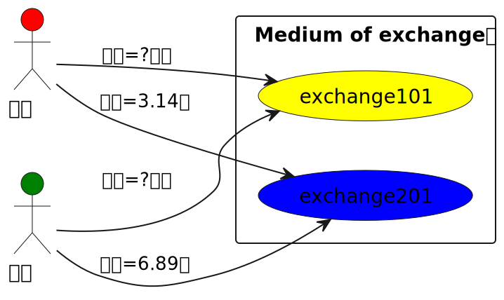

# Digital Money

- Reimagining Money in the Age of Crypto and Central Bank Digital Currency 
https://www.imf.org/en/Publications/fandd/issues/2022/09/Editor-letter-Reimagining-money-in-the-age-of-crypto-and-central-bank-digital-currency

# 101 💰 exchange

Medium of exchange - Money - Wikipedia https://en.wikipedia.org/wiki/Money

> 當貨幣用於商品和服務的交換時，它執行作為交換媒介的功能，從而避免了以貨易貨系統的低效率，例如無法永久確保需求的巧合存在。在以貨易貨系統中的兩方之間，一方可能沒有或能夠製造出另一方想要的物品，這表明不存在供給與需求之間的巧合。擁有交換媒介可以緩解這個低效無巧合問題，因為賣方可以自由地花時間在其他項目上，而不是只為滿足買方的需求。 同時，買者可以通過交換媒介尋找能夠為他們提供想要的物品的賣方。



- 交易紀錄集中寫在市場交換處
- http://localhost:8073/cgi-bin/exchange

```sh
docker compose -f docker-compose.101.yaml up
```

# 102 🐓 ledger

- 交易紀錄各自保管
- http://localhost:8073/cgi-bin/exchange

```sh
docker compose -f docker-compose.102.yaml up
```

# 10x banking

- Banks: At the Heart of the Matter https://www.imf.org/en/Publications/fandd/issues/Series/Back-to-Basics/Banks
> Institutions that match up savers and borrowers help ensure that economies function smoothly

儘管銀行做很多業務，但它們的主要作用是從有錢人那裡吸收資金（稱為存款 deposits ），將其匯集（pool them）起來，然後借給（lend）需要資金的人。 銀行是存款人(depositors,借錢給銀行）和借款人（borrowers, 從銀行借錢）之間的中介。 銀行為存款支付的金額和它們從貸款（loans）中獲得的收入都稱為利息（interest）。存款人可以是個人和家庭、金融和非金融公司，或者國家和地方政府。 借款人是一樣的。 存款可以按需提供（例如支票賬戶）或有一些限制（例如儲蓄和定期存款）。

- https://github.com/mumot1999/sdm-bank/blob/4f32a5298fd8188c5ebcc22e18e980c44ad5a2af/packages/bank-system/docs/usecase.plantuml


# 10x Central Bank Digital Currency

- 央行數位貨幣是良藥還是猛藥？ 日經中文網 https://zh.cn.nikkei.com/columnviewpoint/column/50819-2022-12-19-05-03-00.html?start=0

# 30x escrow

- https://github.com/windranger-io/windranger-treasury/blob/dc95bd5c33432b6752aff3a11cb558cb5e33db09/docs/specs/escrow.puml